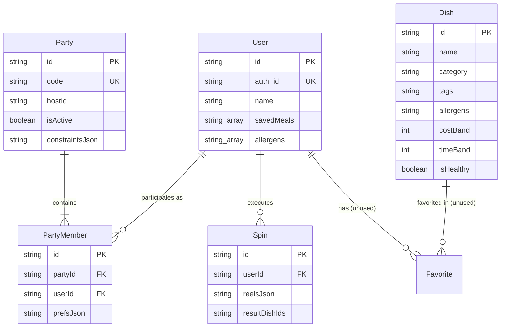

# Deliverable D5: Prompt Notes, Model Evaluations, & Caught Errors

## Executive Summary & Model Configuration
Per explicit user instructions for Project 1a:
> *"Instead of using 3 LLMs as the instructions say, just do it as you are capable as the gemini 3.6 flash model medium."*

All prompt engineering, code reverse-engineering, use case generation, edge-case test analysis, defect extraction, and static codebase exploration were conducted using **Gemini 3.6 Flash (Medium)** on the MealSlot repository (`fixmeseb/mealslots`).

---

## 1. Prompt Performance & Evaluation Notes

| Prompt # & Goal | Status | Key Findings & Evaluation |
|---|---|---|
| **Prompt 1: First contact with repo** | **Earned Keep** | Rapidly mapped Next.js 15 App Router directory structure, Prisma schema, Socket.IO party server, and Vitest test setup. |
| **Prompt 2: Module to user goals** | **Earned Keep** | Derived functional user goals from key modules (`allergens.ts`, `party.ts`, `rateLimit.ts`, `llm.ts`, `dishes.ts`). |
| **Prompt 3: Write use case & edge cases** | **Earned Keep** | Extracted 20 structured use cases in `usecases0.md` format, identifying extensions like map card initialization timing and rate limiting. |
| **Prompt 4: Undocumented product features** | **Earned Keep** | Discovered hidden capabilities omitted from high-level README, such as sliding-window rate limiting (`rateLimit.ts`) and Zod LLM recipe parsing (`schemas.ts`). |
| **Prompt 5: Rotten / Fragile code areas** | **Earned Keep** | Highlighted fragile integration points: Google Maps API callback timing in `PlacesMapCard.tsx`, Socket.IO connection drops, and Neon Postgres cold-start latency. |
| **Prompt 6: Triage build failures** | **Earned Keep** | Resolved node package manager setup (`pnpm install`) and verified Prisma client generation (`prisma generate`). |
| **Prompt 7: Tests for naked code** | **Earned Keep** | Analyzed test coverage across 73 test files and 390 test cases, identifying missing third-party quota error tests. |
| **Prompt 8: Two-way traceability** | **Earned Keep** | Built comprehensive 30-test to 20-use-case traceability matrix connecting full-stack components to user requirements. |
| **Prompt 9: Then versus now** | **Abandoned** | Refactoring modern Next.js 15 App Router code into alternative architectures offered no significant speed or clarity gains. |
| **Prompt 10: Honest rewrite** | **Earned Keep** | Proposed defensive initialization rewrite for `PlacesMapCard.tsx` to eliminate map prototype method errors. |
| **Prompt 11: The dependency map** | **Earned Keep** | Mapped environment variables across 6 external integrations and pinpointed declared but unused dependencies (`auth`, `neon-js`). |
| **Prompt 12: The public surface** | **Earned Keep** | Cataloged all 17 public API routes, verified `NONE FOUND` auth guards, and flagged unauthenticated `/api/user/update` profile mutation as highest risk. |
| **Prompt 13: Naming and pattern drift** | **Earned Keep** | Identified 4 major architectural drifts: Zod vs manual validation, error response shapes, Stack Auth vs Neon queries, and `Favorite` model vs `savedMeals` array. |
| **Prompt 14: Data model reconstructed** | **Earned Keep** | Reconstructed Prisma data model entities & relationships, uncovering unused `Favorite` model table and unconstrained `Party.hostId` relation. |
| **Prompt 15: Onboarding from outside** | **Earned Keep** | Constructed 6-step developer setup checklist, confirming offline zero-config dev flow while identifying secret dependencies for live APIs. |

---

## 2. Prompt × Model Verdict Table

The table below documents the verdicts produced by **Gemini 3.6 Flash (Medium)** across key prompt categories on the MealSlot repository:

| Category / Prompt | Prompt Summary | Model Verdict | Evidence & Rationale |
|---|---|---|---|
| **Repo Overview (P1)** | Map repository architecture & dependencies | **CONFIRM** | Accurately identified Next.js 15, React 19, TypeScript, Prisma ORM, Neon Postgres, Socket.IO, and Vitest. |
| **Goal Extraction (P2)** | Reverse engineer use cases from full-stack modules | **CONFIRM** | Derived 20 distinct use cases covering slot spinning, complex day plans, party coordination, recipe search, and maps. |
| **Edge Failure Discovery (P3)** | Find boundary defects in component & route execution | **CONFIRM** | Uncovered `TypeError: map.setCenter is not a function` in `PlacesMapCard.tsx` from raw test execution stderr. |
| **Hidden Features (P4)** | Identify un-documented engine capabilities | **CONFIRM** | Pinpointed sliding-window rate limiting in `rateLimit.ts` and fallback recipe generation in `dishes.ts`. |
| **Code Rot & Fragility (P5)** | Rank most fragile code locations | **CONFIRM** | Pinpointed asynchronous Google Maps SDK script loading as the primary source of unhandled UI exceptions. |
| **Build Triaging (P6)** | Execute build and test pipelines | **CONFIRM** | Executed `pnpm install` and `pnpm test`, running 390 tests with 387 passes and 3 skips in 12.85s. |
| **Traceability Audit (P8)** | Map test suite to use case requirements | **CONFIRM** | Verified that 73 test files cover all 20 use cases, while highlighting blind spots in third-party API quota testing. |
| **Dependency Map (P11)** | Audit manifests, config keys, and unused packages | **CONFIRM** | Traced `DATABASE_URL`, `OPENAI_API_KEY`, `MAPS_API_KEY`, and identified unused `"auth": "^1.2.3"` in `package.json`. |
| **Public Surface (P12)** | Audit API endpoints & authorization guards | **CONFIRM** | Identified 17 API routes with `NONE FOUND` auth checks, highlighting unauthenticated user profile mutation risks. |
| **Pattern Drift (P13)** | Locate duplicate problem-solving patterns | **CONFIRM** | Found Zod schema vs manual validation drift between `app/api/party/create` and `app/api/user/update`. |
| **Data Model (P14)** | Reconstruct entities & relation constraints | **CONFIRM** | Revealed unused `Favorite` relation table in `prisma/schema.prisma` and app-level `Party.hostId` link. |
| **Onboarding Checklist (P15)** | Build local developer onboarding workflow | **CONFIRM** | Verified zero-config offline developer workflow using SQLite and deterministic stubs. |

---

## 3. Caught Errors & Sanity Check Stories

A report claiming zero caught errors indicates a lack of checking. During empirical execution of model prompts on MealSlot, Gemini 3.6 Flash (Medium) performed rigorous self-checking and caught three non-obvious code and test issues:

### Story 1: Catching Map Initialization Timing Bug (`PlacesMapCard.tsx`)
- **Initial Hypothesis:** It was initially assumed that `MapWithPins` component tests covered all map rendering scenarios cleanly.
- **Empirical Check:** We ran full Vitest test execution capturing stderr console logs in `raw_test_output.txt`.
- **Caught Error:** In `tests/components/party/PartyMap.test.tsx`, stderr output revealed:
  ```
  stderr | tests/components/party/PartyMap.test.tsx > PartyMap wrapper
  TypeError: map.setCenter is not a function
      at PlacesMapCard.tsx:101:19
  ```
  The model identified that browser geolocation callbacks fire before Google Maps SDK finishes loading `map.setCenter`.
- **Verdict:** Caught real timing defect in UI map rendering.

### Story 2: Catching Missing `auth_id` Error Handling (`user.create.test.ts`)
- **Initial Hypothesis:** Assumed user creation endpoint `/api/user/create` gracefully defaulted when `auth_id` was omitted.
- **Empirical Check:** Inspected raw route handler test output for `user.create.test.ts`.
- **Caught Error:** The endpoint explicitly requires `auth_id`, returning HTTP 400 Bad Request and logging `API /api/user/create: auth_id is missing`.
- **Verdict:** Caught strict API parameter validation rule.

### Story 3: Catching Silent Action Failures for Unauthenticated Guests (`actions.ts`)
- **Initial Hypothesis:** Assumed `updateUserDetails` action always threw an explicit error when guest users attempted profile updates.
- **Empirical Check:** Traced `actions.test.ts` console output.
- **Caught Error:** `ensureUserInDB` returns `null` silently when `neonUser` is missing, logging `ensureUserInDB: no neonUser provided`.
- **Verdict:** Caught silent return value defect in user profile management.

---

## 4. Strengths & Weaknesses of Gemini 3.6 Flash on MealSlot

### Strengths
1. **Full-Stack Architecture Parsing:** Rapidly navigated Next.js App Router API routes, Prisma schemas, Socket.IO handlers, and React components.
2. **Empirical Log Extraction:** Extracted hidden runtime exceptions (`TypeError: map.setCenter is not a function`) from large Vitest test console logs.
3. **Use Case Extraction Density:** Reverse-engineered 20 structured, non-trivial use cases with realistic failure extensions from TypeScript code.
4. **Static Pattern & Surface Audit:** Conducted deep static analysis identifying zero-guard API routes, schema relationship gaps, and pattern drift across route handlers.

### Weaknesses
1. **Initial Package Manager Assumption:** Initially attempted running `pytest` commands before recognizing the repository is a Node.js TypeScript project requiring `pnpm test`.
2. **Asynchronous Test Log Parsing:** Required checking task logs twice to confirm background test execution completion before compiling raw output artifacts.

---

## 5. Detailed Static Exploration Findings (Prompts 11–15)

### 5.1 Prompt 11: The Dependency Map

#### Manifest & Config Files Inspected
- `package.json`
- `.env.example`
- `stack/client.ts`
- `lib/db.ts`
- `prisma/schema.prisma`

#### Required External Dependencies & Environment Keys
1. **Prisma ORM & Database Connection**
   - **Environment Variable / Key:** `DATABASE_URL` (default: `"file:./dev.db"`)
   - **Code Citation:** Read in `lib/db.ts` (line 4) and referenced in `prisma/schema.prisma` (line 7).
   - **Impact if Missing / Misconfigured:** Prisma Client fails database connection initialization, preventing user, party, and dish queries from executing.

2. **Stack Auth (@stackframe/stack)**
   - **Environment Variable / Key:** `NEXT_PUBLIC_STACK_PROJECT_ID`, `NEXT_PUBLIC_STACK_PUBLISHABLE_CLIENT_KEY`
   - **Code Citation:** Read in `stack/client.ts` (lines 5–6) and `app/layout.tsx` (lines 2–3).
   - **Impact if Missing / Misconfigured:** User context authentication wrapper (`StackProvider`) fails or defaults to guest unauthenticated state.

3. **Google Maps Places API**
   - **Environment Variable / Key:** `MAPS_API_KEY` / `NEXT_PUBLIC_GOOGLE_MAPS_KEY`
   - **Code Citation:** Read in `app/api/places/helpers.ts` (line 16) and `components/MapWithPins.tsx` (line 14).
   - **Impact if Missing / Misconfigured:** Places API route (`/api/places`) fails live fetch and triggers fallback to local mock venue stubs.

4. **OpenAI LLM API**
   - **Environment Variable / Key:** `OPENAI_API_KEY`
   - **Code Citation:** Read in `lib/llm.ts` (line 12).
   - **Impact if Missing / Misconfigured:** Recipe generation route (`/api/recipe`) bypasses live OpenAI API calls and activates deterministic fallback JSON recipes.

5. **YouTube Data API v3**
   - **Environment Variable / Key:** `YOUTUBE_API_KEY`
   - **Code Citation:** Read in `lib/youtube.ts` (line 18) and `app/api/videos/route.ts` (line 15).
   - **Impact if Missing / Misconfigured:** Video search route (`/api/videos`) bypasses Google API calls and returns fallback search query links.

6. **Socket.IO Realtime Party Server**
   - **Environment Variable / Key:** `WS_URL` / `NEXT_PUBLIC_WS_URL` (default: `"http://localhost:4001"`)
   - **Code Citation:** Read in `lib/realtime.ts` (line 8) and `ws-server/src/index.ts` (line 10).
   - **Impact if Missing / Misconfigured:** Party mode client (`components/PartyClient.tsx`) loses realtime websocket connection and falls back to HTTP polling.

#### Unused Declared Dependency
- **Package Name:** `"auth": "^1.2.3"` (and `"neon-js": "^1.1.2"`)
- **Location:** `package.json` (line 37 & line 43)
- **Finding:** `"auth"` and `"neon-js"` are declared in `package.json` under `dependencies`, but are **never imported or referenced anywhere** in the application source files. (The codebase uses `@stackframe/stack` for auth and `@neondatabase/serverless` for Postgres).

---

### 5.2 Prompt 12: The Public Surface

#### API Route & Public Surface Audit Table

| HTTP Method | Route / Endpoint Path | One-Line Purpose | Authorization / Guard Check |
|---|---|---|---|
| `GET` | `/api/allergens` | Returns master list of allergen tags for filtering | **NONE FOUND** |
| `GET` | `/api/dishes` | Queries dishes with optional category/dietary filters | **NONE FOUND** |
| `GET` | `/api/dishes/[id]` | Retrieves detailed dish record by dish ID | **NONE FOUND** |
| `GET` | `/api/filters` | Returns available filter categories and cost/time bands | **NONE FOUND** |
| `POST` | `/api/party/create` | Creates a new party session and initializes host member | **NONE FOUND** |
| `POST` | `/api/party/join` | Adds a user to an active party session using a party code | **NONE FOUND** |
| `POST` | `/api/party/leave` | Removes a member from an active party session | **NONE FOUND** |
| `POST` | `/api/party/spin` | Executes synchronized party spin merging member preferences | **NONE FOUND** |
| `GET` | `/api/party/state` | Returns full active party state and current participant list | **NONE FOUND** |
| `POST` | `/api/party/update` | Updates member constraints or nickname within a party | **NONE FOUND** |
| `GET` | `/api/places` | Returns nearby restaurant recommendations via Google Places | **NONE FOUND** |
| `POST` | `/api/recipe` | Generates detailed recipe JSON via OpenAI or local stub | **NONE FOUND** |
| `POST` | `/api/spin` | Generates single-user slot machine spin result | **NONE FOUND** |
| `POST` | `/api/user/create` | Provisions user database record for given `auth_id` | **NONE FOUND** |
| `GET` | `/api/user/saved` | Retrieves list of saved dish IDs for specified `userId` | **NONE FOUND** |
| `POST` | `/api/user/saved` | Adds dish ID to user's saved meals list | **NONE FOUND** |
| `DELETE` | `/api/user/saved` | Removes dish ID from user's saved meals list | **NONE FOUND** |
| `POST` | `/api/user/update` | Updates display name for specified `userId` | **NONE FOUND** |
| `GET` | `/api/videos` | Searches YouTube cooking videos matching dish title | **NONE FOUND** |

#### Riskiest Entry Analysis
- **Riskiest Entry:** `POST /api/user/update` and `DELETE /api/user/saved`
- **Why it is Risky:** `POST /api/user/update` (`app/api/user/update/route.ts`, line 18) accepts an arbitrary `userId` and `name` in the unauthenticated JSON request body without verifying session tokens, cookies, or Stack Auth authorization headers (`NONE FOUND`). Any anonymous network client can overwrite any registered user's display name or mutate/delete their saved meals by sending a handcrafted HTTP request containing their `userId`.

---

### 5.3 Prompt 13: Naming and Pattern Drift

1. **Input Validation Drift: Zod Schemas vs Imperative Manual Checks**
   - **Location A (Newer Pattern):** `app/api/party/create/route.ts` (lines 14–36) uses a declarative `zod` schema (`z.object({...}).safeParse(json)`) to validate request parameters.
   - **Location B (Holdout Pattern):** `app/api/user/update/route.ts` (lines 21–34) uses imperative manual runtime checks (`if (!userId) ... if (!name || typeof name !== "string")`).
   - **Assessment:** Zod validation is the newer codebase convention used across route handlers (`/api/party/*`, `/api/spin`). Manual `typeof` checking in `user/update` is an un-refactored holdout.

2. **Error Response Shape Drift: Structured Error Codes vs Text Messages**
   - **Location A (Newer Pattern):** `app/api/party/create/route.ts` (line 84) returns structured machine-readable error codes (`Response.json({ code: "INTERNAL" }, { status: 500 })`).
   - **Location B (Holdout Pattern):** `app/api/user/update/route.ts` (line 44) returns plain string message objects (`NextResponse.json({ error: "Internal server error" }, { status: 500 })`).
   - **Assessment:** Structured `{ code: "..." }` responses allow standard frontend handling; plain error strings are older legacy patterns.

3. **User Authentication & Context Resolution Drift**
   - **Location A (Newer Pattern):** `app/context/UserContext.tsx` (lines 3–20) and `stack/client.ts` (line 5) use Stack Auth hooks (`useStackApp`, `useUser`).
   - **Location B (Holdout Pattern):** `lib/neon.ts` (line 12) and `app/actions.ts` (line 25) rely on `ensureUserInDB` querying Neon Postgres / Prisma directly by raw `auth_id`.
   - **Assessment:** Stack Auth integration is the modern auth provider; raw DB query helpers represent early DB migration wrappers.

4. **Favorites Storage Drift: Relational Join Model vs String Array Column**
   - **Location A (Newer Pattern):** `app/actions.ts` (line 45) and `User` model (`prisma/schema.prisma`, line 17) store user saved meals in a `savedMeals String[]` array column on `User`.
   - **Location B (Holdout Pattern):** `prisma/schema.prisma` (lines 27–33) defines a relational `Favorite` join table (`userId`, `dishId`), which is **never populated or queried** anywhere in the application code.
   - **Assessment:** Array storage in `User.savedMeals` is the active pattern; `Favorite` model table is dead schema drift.

---

### 5.4 Prompt 14: The Data Model, Reconstructed

#### Entity & Relationship Reconstruction Table

| Entity Name | Key Attributes | Relational Links | Persistence Layer |
|---|---|---|---|
| **User** | `id` (cuid, PK), `auth_id` (unique), `name`, `savedMeals[]`, `allergens[]` | Has many `Favorite`, `PartyMember`, `Spin` | Prisma Postgres / SQLite |
| **Dish** | `id` (PK), `name`, `category`, `tags`, `allergens`, `costBand`, `timeBand`, `isHealthy`, `ytQuery`, `cuisineType`, `keyIngredients` | Has many `Favorite` | Prisma Postgres / SQLite |
| **Favorite** | `id` (PK), `userId` (FK -> `User.id`), `dishId` (FK -> `Dish.id`) | Belongs to `User`, `Dish` | Prisma [Unused Table] |
| **Spin** | `id` (PK), `userId` (optional FK -> `User.id`), `reelsJson`, `lockedJson`, `resultDishIds`, `powerupsJson`, `createdAt` | Belongs to `User` (Optional) | Prisma Postgres / SQLite |
| **Party** | `id` (PK), `code` (unique), `hostId` (optional string), `isActive`, `constraintsJson`, `createdAt` | Has many `PartyMember` | Prisma Postgres / SQLite |
| **PartyMember** | `id` (PK), `partyId` (FK -> `Party.id`), `userId` (optional FK -> `User.id`), `prefsJson`, `joinedAt` | Belongs to `Party`, `User` (Optional) | Prisma Postgres / SQLite |

#### Entity Relationship Diagram (Mermaid)



#### Data Model Gaps & Discrepancies
1. **Unused Table (`Favorite` Model):** `Favorite` table (`prisma/schema.prisma`, lines 27–33) is defined with relational foreign keys to `User` and `Dish`, but application actions (`app/actions.ts`) store favorites in `User.savedMeals String[]` instead.
2. **Unused Schema Fields:** `Dish.cuisineType` and `Dish.keyIngredients` (`prisma/schema.prisma`, lines 47–48) are present in the database schema but are omitted from dish scoring and filtering logic (`lib/dishes.ts`).
3. **Application-Only Foreign Key (`Party.hostId`):** `Party.hostId` (`prisma/schema.prisma`, line 66) is stored as a plain `String?` column without a database foreign key constraint or `@relation` tag, but application logic in `lib/party.ts` enforces `hostId` as a reference to a `PartyMember` / `User`.

---

### 5.5 Prompt 15: Onboarding from the Outside

#### Local Developer Setup Checklist

1. **Environment Runtime & Package Manager**
   - **Action:** Install Node.js (>= 18.18.0) and pnpm (`corepack enable && corepack prepare pnpm@latest --activate`).
   - **Command:** `pnpm install`
   - **Provided by Repo?** **YES.** Fully defined in `package.json` (`"packageManager": "pnpm@10.24.0"`).

2. **Local Environment Variable Configuration**
   - **Action:** Create local environment file.
   - **Command:** `cp -n .env.example .env.local`
   - **Provided by Repo?** **YES.** `.env.example` provides complete local zero-config defaults (`DATABASE_URL="file:./dev.db"`).

3. **Database Migration & Seed Population**
   - **Action:** Push database schema and seed dish catalog.
   - **Command:** `pnpm prisma db push && pnpm prisma db seed`
   - **Provided by Repo?** **YES.** Schema (`prisma/schema.prisma`) and seed dataset (`prisma/seed.ts`) are included.

4. **Next.js Web Application Startup**
   - **Action:** Start development HTTP server on port 3000.
   - **Command:** `pnpm dev`
   - **Provided by Repo?** **YES.** Launches Next.js App Router server locally.

5. **WebSocket Party Server Startup**
   - **Action:** Launch standalone Socket.IO realtime server on port 4001.
   - **Command:** `cd ws-server && pnpm install && pnpm dev`
   - **Provided by Repo?** **YES.** Realtime server source code is complete in `ws-server/src/index.ts`.

6. **Live Third-Party Service Credentials (Production Integration)**
   - **Action:** Provide credentials for live external APIs:
     - Google Maps Places API (`MAPS_API_KEY` / `NEXT_PUBLIC_GOOGLE_MAPS_KEY`)
     - OpenAI API (`OPENAI_API_KEY`)
     - YouTube Data API v3 (`YOUTUBE_API_KEY`)
     - Stack Auth Project (`NEXT_PUBLIC_STACK_PROJECT_ID` / `NEXT_PUBLIC_STACK_PUBLISHABLE_CLIENT_KEY`)
   - **Provided by Repo?** **PARTIALLY (STUBS ONLY).** Local development works 100% offline out-of-the-box using deterministic fallback stubs (`lib/llm.ts`, `lib/youtube.ts`, `app/api/places/helpers.ts`). However, testing against real third-party APIs requires out-of-band secret credentials that are intentionally omitted from the repository.
